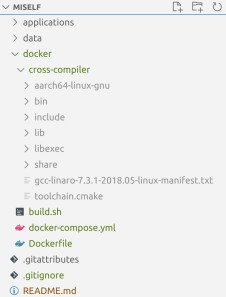

# MiSelf: Micro-Benchmark Suite for Designing Self-Driving Vehicles
# Included Microbenchmarks:
- Structure-From-Mothion  =>  OpenMVG (CPU/GPU, C++)
- Object Detection:       =>  Jetson-Inference(Hello_Ai_World) (CPU/GPU, C++)
- Lane Detection:         =>  Jetson TX2 Lane Detection (CPU/GPU, C++)
- Extended Kalman Filter => CarND-Extended-Kalman-Filter (CPU, C++)

# Step 0: Download MiSelf :)

# Step 1: (Cross) Compilation using qemu based docker
We are using dockers to compile the source code of the micro-benchmarks. Please navigate to the `docker` folder and perform the following steps:
## Setting up qemu based cross-compiler env
* `sudo apt-get install qemu binfmt-support qemu-user-static # Install the qemu packages`
* `docker run --rm --privileged multiarch/qemu-user-static --reset -p yes # This step will execute the registering scripts`
* Pleaser refer [to this link](https://www.stereolabs.com/docs/docker/building-arm-container-on-x86/) for more details. 

## Getting the virtual L4T ready
* `docker-compose build` : This will prepare the environment to build the applications.
* You can check the version of L4T running on the NVidia board with jtop. 
* This is the most time-consuming step of the process. Remember to grab your coffee at this point. We are downloading all the necessary tools so that you don't have to compile on the board.
<!-- Download the correct cross compiler corresponding to the L4T version from nvidia's website and place it inside the `cross-compiler` folder. Now this folder should look like this:

 -->
## Ready to cross compile
* `docker-compose up`: This will utilize the compilers inside the build environment to produce the binaries. By default it calls the `build.sh` script which builds the applications one by one and produces the final binaries in a `applications/bin` folder. Once the applications are generated, you are ready to run them!

* [Debug] For using an interactive debugging environment, please run `docker-compose run miself.builder bash`

# Step 2: Deployment on board
* Please ensure that `rsync` is installed in both host and target, and additionally `sshpass` is installed on host. 
* In `scripts/remote_sync.sh` modify the remote credentials where you want to deploy. 
* Create a file called `scripts/passwd` to store the ssh password.
* Next using `bash` shell execute `scripts/send.sh applications/bin bin`. If you are using VSCode, we already include a 'Send Binaries' task.
# Step 3: Running on board
## Essential dependencies version on Hydra:
- Eigen3 -- 3.3.9
- Ceres Solver -- 2.0.0
- ROS Melodic

# For run application on sample inputs as quick start:
### OpenMVG: 
[https://github.com/openMVG/openMVG](https://github.com/openMVG/openMVG)

`$ cd openMVG_Build/software/SfM/`

`$ python SfM_GlobalPipeline.py [full path image directory] [resulting directory]`          

`$ python SfM_GlobalPipeline.py ~/home/user/data/ImageDataset_SceauxCastle/images ~/home/user/data/ImageDataset_SceauxCastle/Castle_Global_Reconstruction`

The asscociate Image_dataset is under the openMVG folder.

### Jetson-Inference:
[https://github.com/dusty-nv/jetson-inference#recommended-system-requirements](https://github.com/dusty-nv/jetson-inference#recommended-system-requirements)

First you will need to build the project following the instruction on Dusty's website.
There're two way to build it:
- Running the Docker Container  --  https://github.com/dusty-nv/jetson-inference/blob/master/docs/aux-docker.md

- Building the Project from Source  --  https://github.com/dusty-nv/jetson-inference/blob/master/docs/building-repo-2.md

I build the project from source for Hydra.
Then to run Classifying Images with ImageNet: \
`$ cd jetson-inference/build/aarch64/bin` \
To run C++ sample program: \
`$ ./imagenet images/orange_0.jpg images/test/output_0.jpg     # (default network is googlenet)` \
To run Python sample program: \
`$ ./imagenet.py images/orange_0.jpg images/test/output_0.jpg  # (default network is googlenet)` \

##### If you met "failed to open swrast" issue, you could try link the libdrm.so.2 to libdrm.so.2.4.0 (Thank you Hans!)
`$ cd /usr/lib/aarch64-linux-gnu` \
`$ sudo ln -sf libdrm.so.2.4.0 libdrm.so.2` \

Except for object detection, Jetson-Inference have more features like Locating and Semantic Segmentation in the future that we might need to work with. \

### Jetson TX2 Lane Detection:
[https://github.com/jaredraycoleman/lane_detection](https://github.com/jaredraycoleman/lane_detection)

To build the application, we first need to modify two functions in src/detector.cpp since the updated OpenCV version: \

`sudo vim src/detector.cpp`

> line 51: 	CV_FOURCC('M', 'P', 'E', 'G') -> cv::VideoWriter::fourcc('M', 'P', 'E', 'G')
> Line 284:	CV_BGR2GRAY -> cv::COLOR_BGR2GRAY

Then we will need to install the dependencies and then build: \
`$./install_dependencies.sh` \
`$./build.sh` \
`$./build.sh clean` \

Then after building the application, we can run the sample with the run.sh we wrote. \

### CarND-Extended-Kalman-Filter:
[https://github.com/jeremy-shannon/CarND-Extended-Kalman-Filter-Project](https://github.com/jeremy-shannon/CarND-Extended-Kalman-Filter-Project) \
Clone this repo. \
Make a build directory: `mkdir build && cd build` \
Compile: `cmake .. && make` \
On windows, you may need to run: `cmake .. -G "Unix Makefiles" && make` \
Run it: `./ExtendedKF path/to/input.txt path/to/output.txt.` You can find some sample inputs in 'data/'. eg. `./ExtendedKF ../data/sample-laser-radar-measurement-data-1.txt output.txt` \

### LaneNet-Lane-Detection:
[https://github.com/MaybeShewill-CV/lanenet-lane-detection](https://github.com/MaybeShewill-CV/lanenet-lane-detection) \
To test a single image with the trained model, use the following: \
`cd lanenet-lane-detection/lanenet-lane-detection` \
`python python tools/test_lanenet.py --weights_path /PATH/TO/YOUR/CKPT_FILE_PATH --image_path ./data/tusimple_test_image/0.jpg` \
Please note that the ckpt are save in miself/applications/lanenet-lane-detection/model/tusimple_lanenet.
The runing command is like this: \
`python3.6 tools/test_lanenet.py --weights_path /PATH/TO/APPLICATIONS/lanenet-lane-detection/model/tusimple_lanenet/tusimple_lanenet.ckpt --image_path ./data/tusimple_test_image/0.jpg` \
If you meet the error like "ImportError: /PATH/TO/SOME/FILE: cannot allocate memory in static TLS block"
you may need to proload the library. You can do it like this: \
`LD_PRELOAD=NAME_OF_THE_LIBARY python3 YOUR_PYTHON_SCRIPT` \

# Thanks the Authors for all these applications!
[Authors](https://github.com/duttresearchgroup/miself/files/6209700/Authors.txt)

